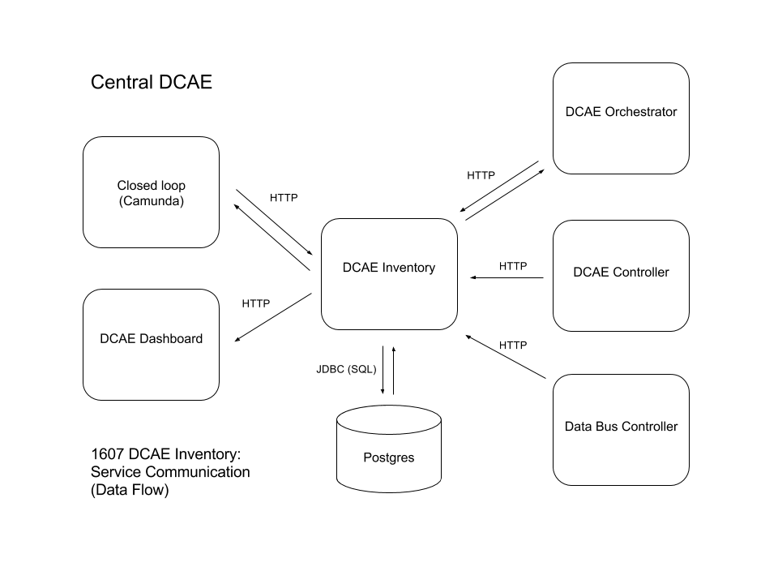

# DCAE Inventory: Design

The DCAE Inventory is a web service that is responsible for managing DCAE service and DCAE service type information.

## Terminology

#### VNF

"Virtual Network Function"

Services that are customer facing and require monitoring.

#### DCAE

"Data Collections Analytics Events"

A system responsible for monitoring and characterizing performance and behavior of running VNF services.  DCAE emits events that are used by operations and to possibly change the policy of the managed VNF service.

#### DCAE service component

Applications and services that are built to be connected together to make up a DCAE service.  These applications and services fall into the following categories:

* Collectors
* Analytics
* Storage
* Data buses

#### DCAE service type

Contains:

* Composition details of a network of DCAE service components in the form of a Cloudify blueprint template
* Metadata used to describe the DCAE service type
* Relationship information - how it relates to associated services and VNF types

Cloudify blueprint template refers to a Cloudify blueprint that has unbound variables that is to be resolved before use for orchestration.

DCAE service type has a tight coupling with DCAE services where all DCAE services must be associated with a single existing DCAE service type.  This is reinforced by the DCAE Inventory.

#### DCAE service

A fully composed, running instance of a DCAE service type.  The DCAE service is intended to collect data and to perform a set number of pre-defined analysis on a running VNF.  A single DCAE service is associated with a single running VNF.

DCAE service is a resource with a representation that is provided by DCAE Inventory.

## What is DCAE Inventory

DCAE Inventory is a web service that provides the following:

1. Real-time data on all DCAE services and their components
2. Comprehensive details on available DCAE service types

DCAE Inventory is a composite API that relies on other APIs to obtain resources on underlying components and uses these resources to compose a DCAE service resource.  In addition, DCAE Inventory will store data that is unique to the DCAE service level including:

* DCAE service metadata
* DCAE service type description and composition details
* Relationships between DCAE service and DCAE service types and their respective VNF and VNF types

DCAE Inventory has a REST interface to service client requests.  It has a well-defined query interface that would filter result sets based upon resource attributes. 

### API

The full REST API reference can be found [here](API.adoc) (Careful! It's in AsciiDoc format).  The DCAE Inventory service has been built to use [Swagger.io](http://swagger.io/) to document the API.  The running service provides a YAML or JSON version of the specification of the DCAE Inventory API.  Make the following curl call to fetch the YAML version:

```
curl <DCAE Inventory hostname>:8080/swagger.yaml
```

#### Using Swagger UI

Use the following Swagger UI [chrome extension](https://chrome.google.com/webstore/detail/swagger-ui-console/ljlmonadebogfjabhkppkoohjkjclfai?hl=en) to view the specification in a nice view.  Enter the URL you used in the above example `<DCAE Inventory hostname>:8080/swagger.yaml` into the input box of the Swagger UI page and hit *Explore*.  You should see the complete API under *default*.

## What DCAE Inventory is not

* Not an inventory nor a catalog for VNFs
* Not a catalog for DCAE components
* Not the Data Bus controller's database
* Not an orchestrator nor does it do DCAE service creation

## Use cases

### Closed-loop orchestration

The DCAE platform makes DCAE system changes upon change triggers from A&AI.

A&AI emits events upon the creation and the destruction of a VNF.  These events contain information on what sort of change occurred and the VNF associated with the change.  These events are handled by DCAE Orchestrator and triggers the process of orchestrating the deployment or the undeployment of a DCAE service associated with the VNF.  DCAE Orchestrator makes queries to DCAE Inventory who then provides the information to ultimately answer the question "given this VNF, what DCAE service should be deployed or be undeployed?"

During the orchestration process, DCAE Orchestrator pushes details of the deployed/undeployed DCAE services.  These runtime details are stored and managed by the DCAE Inventory.

### DCAE services dashboard

The DCAE dashboard provides visibility into running DCAE services for operational purposes.  It queries the DCAE Inventory for aggregate details on all the running DCAE services and for getting up-to-date status information on DCAE services and their components.

## Service dependencies

DCAE Inventory relies on several APIs to construct its composite resource in addition to the data that DCAE Inventory stores.

The following is a communication diagram of how the data flows between the DCAE Inventory and its dependencies:



### DCAE Controller

DCAE Inventory queries the DCAE controller to obtain an up-to-date projection of the state data per DCAE service component including their status i.e. DEPLOYED, RUNNING.

### Data Bus Controller

DCAE Inventory queries the Data Bus controller to obtain feed/topic details including the connection relationship between DCAE service components.

### DCAE Orchestrator

DCAE Inventory relies on the DCAE Orchestrator to push details of a DCAE service during the orchestration process particularly the DCAE service component runtime configuration information.

### Camunda (Closed Loop)

Camunda is a workflow design tool that creates and edits DCAE service types.  In order to do DCAE service type updates, Camunda via a proxy service:

1. Queries the DCAE Inventory for existing DCAE services for the given DCAE service type
2. Undeploys all those DCAE services
3. PUTs the new version of the DCAE service type

The DCAE service types are associated with closed loop specific VNFs.

## Technical implementation

### Database

DCAE Inventory uses the central Postgres as its database to store and to query its DCAE Inventory unique datasets.  You can find the current table schemas for the DCAE Inventory tables [here](DatabaseTables.md).

### Resiliency

The central Postgres database has site-to-site replication to a redundant DCAE central location so the DCAE Inventory datasets are covered.  The DCAE Inventory service is designed to be state-less and requires just the proper configuration information to be able to service requests.  Configuration information includes:

* Database connection details
* DCAE controller connection details
* Data bus controller connection details

The chance of complete service outages is minimized by having redundancy.  This requires load balancers for traffic management which does periodic health checks on all the instances to see if they are alive.

### Security

TBD
